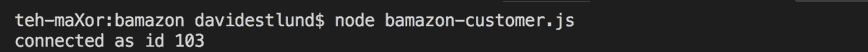
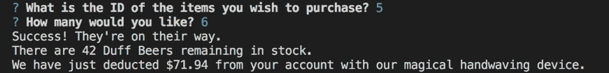
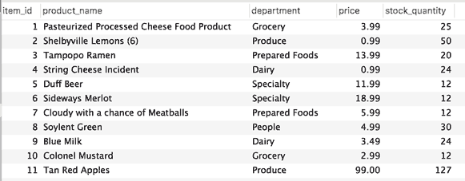

# Bamazon
*The most sophisticated eCommerce app I've ever made.*

## The user interface:

Start the app by typing `node bamazon-customer.js`:

Then purchase one of our ten fabulous products by specifying the item number and quantity:

You will be charged appropriately and the items will ship post-haste from our state-of-the-art warehouse.

You can continue shopping:

Try not to order a product that isn't one of our ten fabulous products:

Since we are a very real business with real inventory limitations, please do not order more than we have in stock:

When finished shopping, simply exit Bamazon by refusing to continue shopping. We thank you for your business!

## The database:

At Bamazon, we pride ourselves on clean data. Feel free to replicate our majestic table using the `make-bamazon.sql` query found in this repository.

